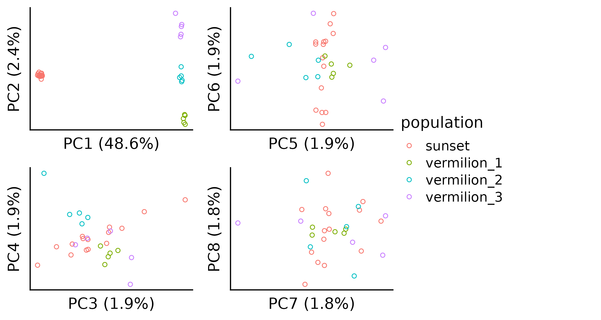
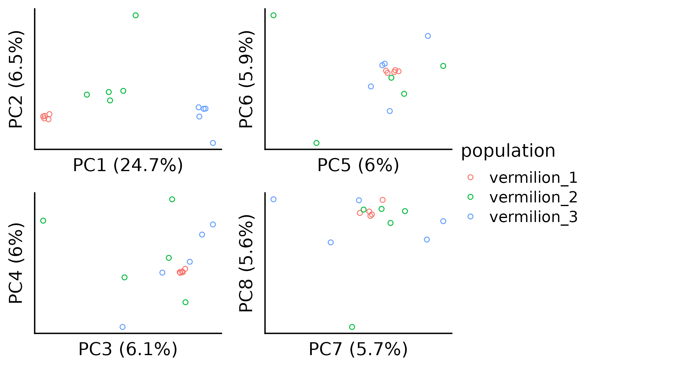
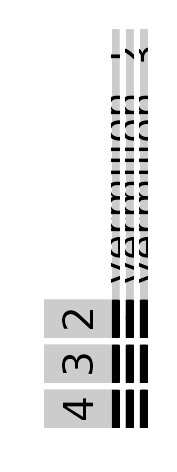
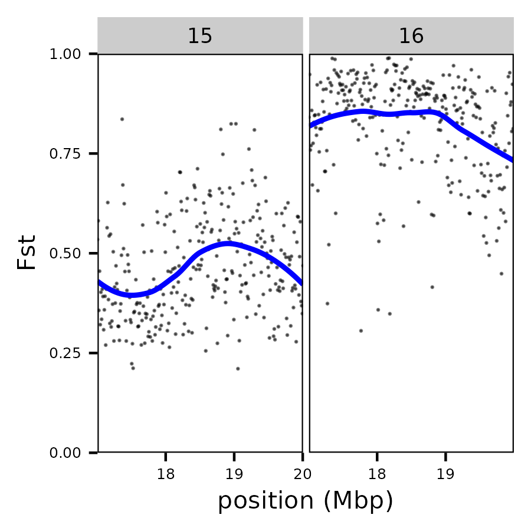
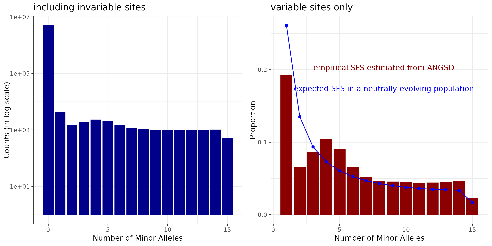
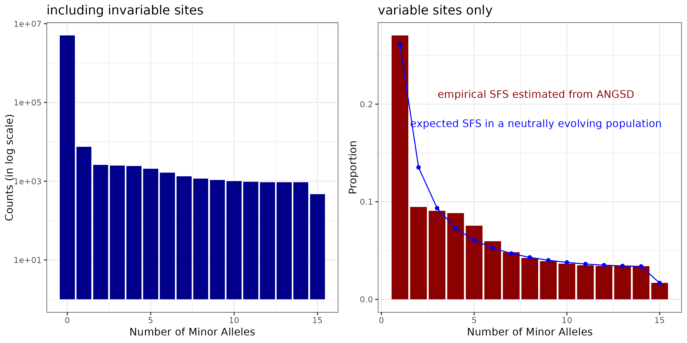
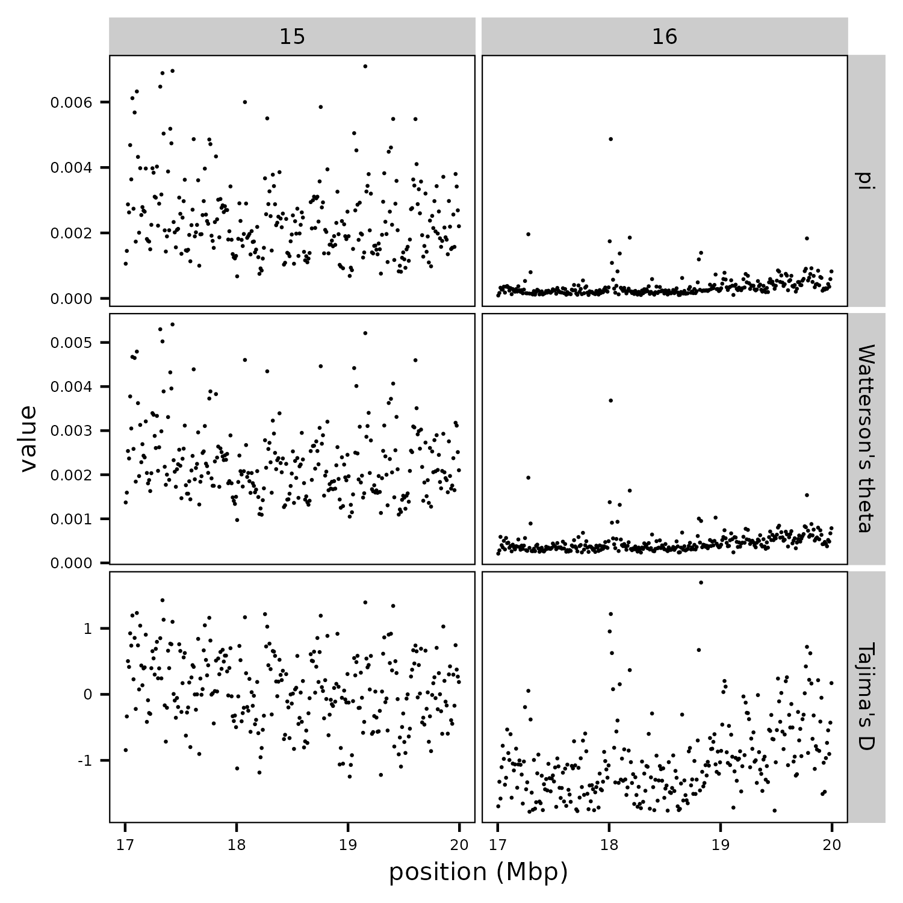
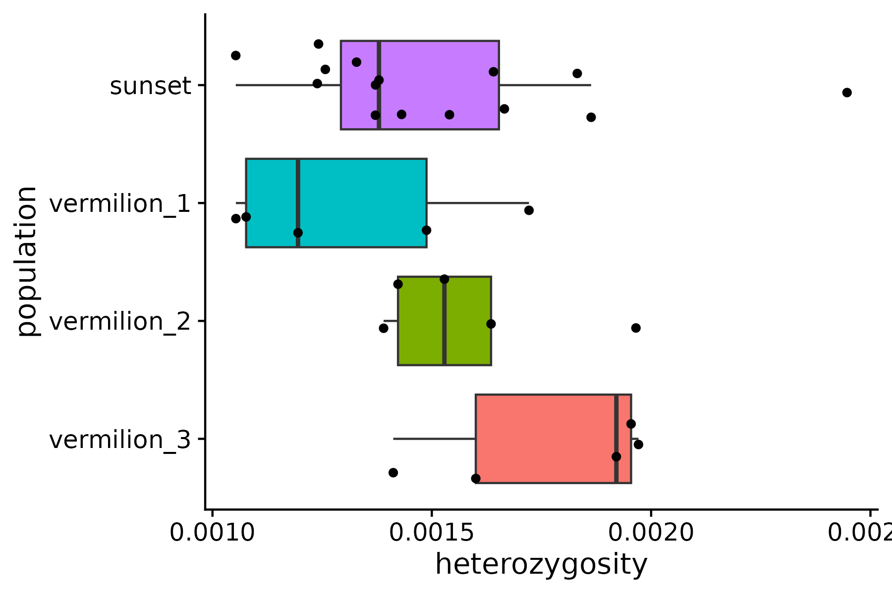
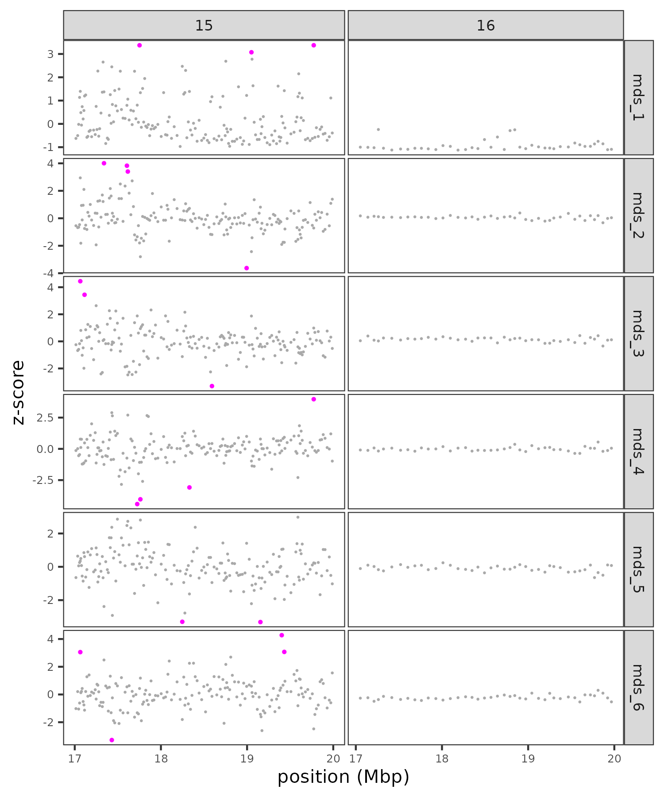
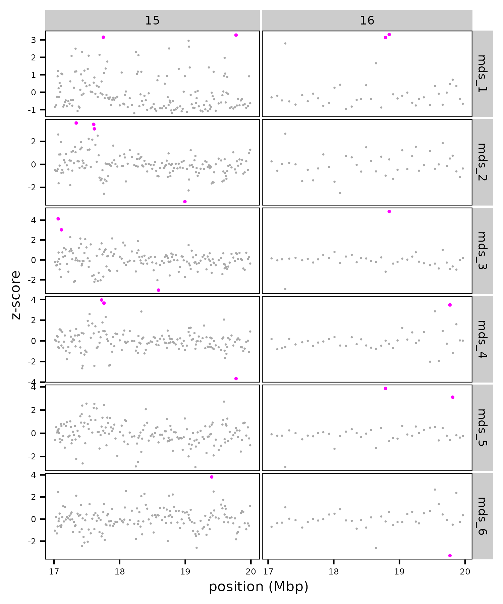

Toyfish - a quick start guide with an example dataset
================

- [Dataset overview](#dataset-overview)
- [Setting up the pipeline](#setting-up-the-pipeline)
- [Preparing the project directory and required input
  files](#preparing-the-project-directory-and-required-input-files)
- [Launching the pipeline](#launching-the-pipeline)
- [Example output](#example-output)
  - [Pipeline flowchart](#pipeline-flowchart)
  - [Depth distribution and choice of depth
    filters](#depth-distribution-and-choice-of-depth-filters)
  - [PCA](#pca)
  - [Admixture analysis](#admixture-analysis)
  - [Fst between sunset and
    vermilion](#fst-between-sunset-and-vermilion)
  - [Site frequency spectrum](#site-frequency-spectrum)
  - [Theta and neutrality stats in 10000bp
    windows](#theta-and-neutrality-stats-in-10000bp-windows)
  - [Heterozygosity estimates](#heterozygosity-estimates)
  - [Local PCA](#local-pca)

## Dataset overview


(Image credit:
[NOAA](https://www.fisheries.noaa.gov/west-coast/science-data/southern-california-shelf-rockfish-hook-and-line-survey))

To help users quickly learn and test loco-pipe on their own, we provide
a heavily subsetted lcWGS dataset with which the pipeline can be run in
a few minutes. This dataset that we call “toyfish” is part of a larger
rockfish dataset that the Sudmant lab has generated together with
several collaborators. It is composed of 30 rockfish individuals from a
pair of sister taxa: sunset rockfish (Sebastes crocotulus) and vermilion
rockfish (Sebastes miniatus). Each species has 15 specimens. Within
vermilion, there are three populations that are genetically distinct:
vermilion_1, vermilion_2 and vermilion_3; each population has 5
specimens.

As shown in the picture above, these two species are very similar in
their phenotype and even experts cannot accurately to tell them apart.
It is even harder to distinguish one vermilion population from another
based only on visual cues. So hopefully, in addition to teaching users
about loco-pipe, this example dataset will be a good demonstration of
the power of lcWGS in characterizing population structure in natural
populations.

Raw sequencing data were generated from an Illumina Novaseq sequencer,
and we performed quality filtering and sequence alignment with
[grenepipe](https://github.com/moiexpositoalonsolab/grenepipe). For
reference genome, we used the vermilion genome generated by [Kolora et
al. 2021](https://www.science.org/doi/full/10.1126/science.abg5332).
Rockfish has 24 chromosomes; however, with the aim of having a small
test dataset, we selected a 3Mbp region from chromosomes 15 and 16 (from
17Mbp to 20Mbp), and further subsetted their read depth to 40% of the
original data. These bam files are stored in `toyfish/bams`. The
subsetted reference genome sequence and its index file are stored in
`toyfish/reference`

## Setting up the pipeline

1.  Install
    [mamba](https://mamba.readthedocs.io/en/latest/installation/mamba-installation.html)
    or conda
    (<https://docs.conda.io/projects/conda/en/stable/user-guide/install/index.html>)
    if you have not already done so. A fresh install of mamba with
    miniforge (<https://github.com/conda-forge/miniforge>) is highly
    recommended because mamba is much faster than conda. It is ok if you
    prefer to use conda though; just replace all occurrences of `mamba`
    with `conda` in the code below.

2.  Download `loco-pipe` from GitHub (e.g. using
    `git clone https://github.com/sudmantlab/loco-pipe.git`). We
    recommend you to download it to a folder where you store your
    software programs. We will refer to the full path of the directory
    that contains the `loco-pipe` folder as `SOFTWARE_DIR`.

3.  Create the `loco-pipe` conda environment using mamba by running
    `mamba env create -f $SOFTWARE_DIR/loco-pipe/workflow/envs/loco-pipe.yaml`
    (replace \$SOFTWARE_DIR with a real path).

4.  (Optional) If you would like to run PCA with the software
    [PCAngsd](https://github.com/Rosemeis/pcangsd) using loco-pipe, you
    **must** install PCAngsd manually as it is not yet available on
    conda. Please install it to a conda environment named
    `pcangsd_lcpipe` using the script below. Even if you already have
    PCAngsd installed on your machine, you will need to run the
    following code to ensure that the version is compatible.

    ``` bash
    # first set your working directory to a folder where you store your software programs
    cd $SOFTWARE_DIR # replace $SOFTWARE_DIR with a real path
    # download PCAngsd from Github
    git clone https://github.com/Rosemeis/pcangsd.git
    cd pcangsd
    # check out the version the loco-pipe is based on
    git checkout f90d41f7b9b245481781ae319c4a174376e5f471
    # create an environment for PCAngsd 
    mamba env create -f $SOFTWARE_DIR/loco-pipe/workflow/envs/pcangsd.yaml
    # activate the conda environment
    conda activate pcangsd_lcpipe
    # build PCAngsd
    python setup.py build_ext --inplace  
    pip3 install -e .
    # deactivate the conda environment
    conda deactivate  
    ```

5.  (Optional) If you would like to run local PCA with the
    [lostruct](https://github.com/petrelharp/local_pca) package in R
    using loco-pipe, you **must** install lostruct (in addition to
    PCAngsd, see above) manually as it is not yet available on conda.
    Please install it to a conda environment named `lostruct_lcpipe`
    using the script below.

    ``` bash
    # create a conda environment named lostruct_lcpipe and install R and some key R packages
    mamba env create -f $SOFTWARE_DIR/loco-pipe/workflow/envs/lostruct.yaml
    # activate the lostruct conda environment
    conda activate lostruct_lcpipe
    # launch R
    R
    # install lostruct
    devtools::install_github("petrelharp/local_pca/lostruct", ref = "93ad59309151e44d2d3d0d7748cdc92f6121f564")
    # quit R
    q()
    # deactivate the conda environment
    conda deactivate  
    ```

    Note: depending on your system, you may need to ensure that lostruct
    is properly installed to the `lostruct_lcpipe` environment with
    something like the following

    ``` r
    withr::with_libpaths(new = "/path/to/conda/envs/lostruct_lcpipe/lib/R/library",
                         devtools::install_github("petrelharp/local_pca/lostruct"))
    ```

## Preparing the project directory and required input files

The sequence alignment files, reference genome, sample table, chromosome
table, and pipeline configuration file for toyfish are already set up
for you. However, we still need to change some file paths to match the
ones on your computer.

1.  Define the environmental variable `SOFTWARE_DIR`. Replace `/path/to`
    with the path of the directory that contains `loco-pipe`

    ``` bash
      SOFTWARE_DIR=/path/to
    ```

2.  Run the shell script `toyfish/prepare.sh` to update file paths in
    the sample table and the pipeline configuration file

    ``` bash
    bash $SOFTWARE_DIR/loco-pipe/toyfish/prepare.sh
    ```

3.  If you want to run `toyfish` on a computer cluster, also edit the
    `cluster_config.yaml` file under `workflow/profiles` to make sure
    that your cluster settings are specified correctly.

## Launching the pipeline

1.  Activate the `loco-pipe` environment with

    ``` bash
    conda activate loco-pipe
    ```

2.  Plot the pipeline flowchart

    ``` bash
    mkdir -p $SOFTWARE_DIR/loco-pipe/toyfish/figures/flowchart
    snakemake -n --forceall --rulegraph \
    --directory $SOFTWARE_DIR/loco-pipe/toyfish \
    --snakefile $SOFTWARE_DIR/loco-pipe/workflow/pipelines/loco-pipe.smk  | \
    dot -Tpdf > $SOFTWARE_DIR/loco-pipe/toyfish/figures/flowchart/toyfish.pdf
    ```

3.  Launch the pipeline

    On a single machine (change `--cores` to the number of cores that
    you have available):

    ``` bash
    snakemake \
      --use-conda \
      --conda-frontend mamba \
      --directory $SOFTWARE_DIR/loco-pipe/toyfish \
      --rerun-triggers mtime \
      --scheduler greedy \
      --printshellcmds \
      --snakefile $SOFTWARE_DIR/loco-pipe/workflow/pipelines/loco-pipe.smk \
      --cores 1 -n
    ```

    On a computer cluster:

    ``` bash
    snakemake \
      --use-conda \
      --conda-frontend mamba \
      --directory $SOFTWARE_DIR/loco-pipe/toyfish \
      --rerun-triggers mtime \
      --scheduler greedy \
      --printshellcmds \
      --snakefile $SOFTWARE_DIR/loco-pipe/workflow/pipelines/loco-pipe.smk \
      --profile $SOFTWARE_DIR/loco-pipe/workflow/profiles/slurm \
      --default-resources mem_mb=None disk_mb=None -n
    ```

    Note that the ending `-n` flag means it is a dry run. If the dry run
    goes through, remove `-n` to actually run the pipeline.

## Example output

Below are some figures that are automatically plotted by loco-pipe.
After running it with the toyfish dataset, you should see these figures
recreated in the `toyfish/figures` folder.

#### Pipeline flowchart

[flow chart](toyfish/figures/flowchart/toyfish.pdf)

<br>

#### Depth distribution and choice of depth filters


A density plot showing the empirical sequencing depth distribution (in
black), and the fitted truncated normal distribution (in blue). The mean
and standard deviation of the fitted distribution are shown on the top
corner, and the chosen minimum and maximum depth filters are represented
by the red lines.

<br>

#### PCA

###### All samples combined



A PCA plot showing the top eight PC axes with all samples combined. Each
point is an individual, and they are colored by the population that they
belong to. A thinned SNP list is used for this analysis.

<br>

###### Vermilion only



A PCA plot showing the top eight PC axes with the vermilion samples
only. Each point is an individual, and they are colored by the
population that they belong to. A thinned SNP list is used for this
analysis.

<br>

#### Admixture analysis

###### All samples combined


An admixture plot with all samples combined and K=2-7 source
populations. Each bar is an individual, and each colors represent a
source population. A thinned SNP list is used for this analysis.

<br>

###### Vermilion only



An admixture plot with the vermilion samples only and K=2-4 source
populations. Each bar is an individual, and each colors represent a
source population. A thinned SNP list is used for this analysis.

<br>

#### Fst between sunset and vermilion

###### Per-SNP estimates


Per-SNP Fst between sunset and vermilion rockfish along the subsetted
genome.

<br>

###### In 100-SNP windows


Fst in 100-SNP windows between sunset and vermilion rockfish along the
subsetted genome.

<br>

###### In 10000bp windows



Fst in 10000bp windows between sunset and vermilion rockfish along the
subsetted genome.

<br>

#### Site frequency spectrum

###### Sunset



###### Vermilion



#### Theta and neutrality stats in 10000bp windows

###### Sunset


Nucleotide diversity (pi), Watterson’s theta, and Tajima’s D in 10000bp
windows along the subsetted genome in sunset rockfish.

<br>

###### Vermilion



Nucleotide diversity (pi), Watterson’s theta, and Tajima’s D in 10000bp
windows along the subsetted genome in vermilion rockfish.

<br>

#### Heterozygosity estimates



Average heterozygosity of each sample over the subsetted genome. Each
point represents a sample, and they are grouped by the population that
they belong to.

<br>

#### Local PCA

Note that since this is a highly susbsetted dataset, the local PCA
results are for demonstration purpose only and any signals are likely
artifacts rather than reflecting biologically meaningful patterns.

###### Local PCA MDS plot when combining all chromosomes



An MDS plot showing the z-score of each 100-SNP window along the top six
MDS axes. Windows with z-scores higher than 3 or lower than -3 along a
certain axis are considered outliers and are colored in magenta. Outlier
windows along the same axis tend to show similar PCA patterns among
themselves and distinct patterns when compared to the genome-wide
average. The MDS is conducted combining all chromosomes for this plot,
so outlier windows along the same axis in different chromosomes tend to
shown similar patterns.

<br>

###### Local PCA outlier window consensus PCA plots when combining all chromosomes


Consensus PCA plots showing the combined PCA pattern of outlier windows
along each MDS axis. A consensus PCA plot with all the non-outlier
windows is also generated.

<br>

###### Local PCA MDS plot when running each chromsome separately



An MDS plot showing the z-score of each 100-SNP window along the top six
MDS axes. Windows with z-scores higher than 3 or lower than -3 along a
certain axis are considered outliers and are colored in magenta. Outlier
windows along the same axis tend to show similar PCA patterns among
themselves and distinct patterns when compared to the genome-wide
average. The MDS is conducted for each chromosome separately for this
plot, so outlier windows along the same axis in different chromosomes
don’t necessarily show similar patterns.

<br>

###### Local PCA outlier window consensus PCA plots when running each chromsome separately

[consensus PCA](toyfish/figures/lostruct/global/separated.pca.pdf)

Consensus PCA plots showing the combined PCA pattern of outlier windows
along each MDS axis with each chromosome analysed separately.

<br>
