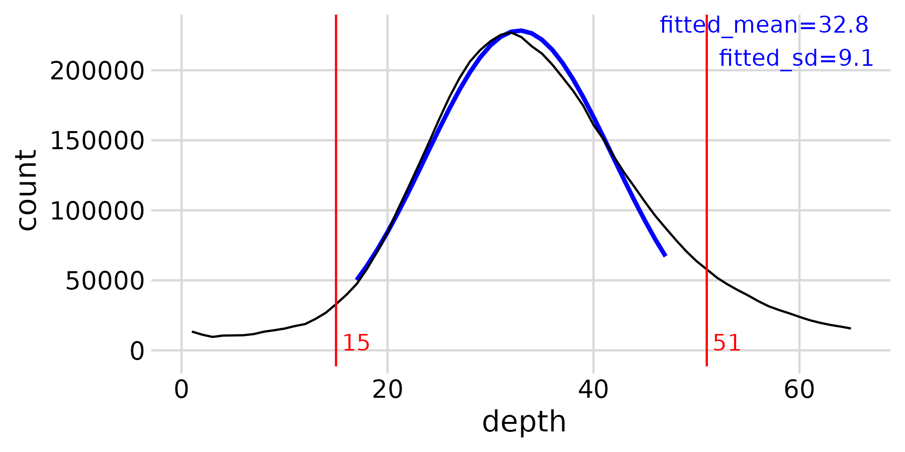
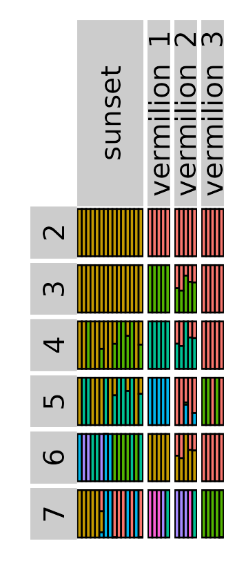
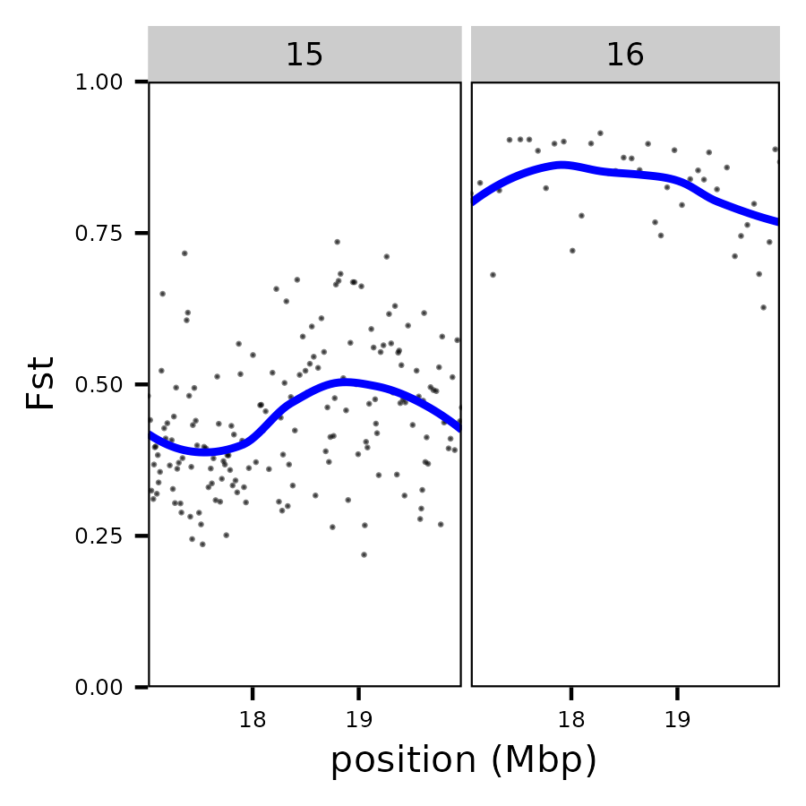
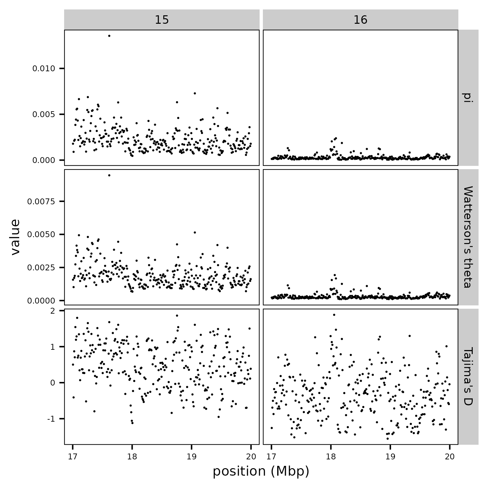

Toyfish - a quick tutorial with an example dataset
================

- <a href="#dataset-overview" id="toc-dataset-overview">Dataset
  overview</a>
- <a href="#setting-up-the-pipeline"
  id="toc-setting-up-the-pipeline">Setting up the pipeline</a>
- <a href="#preparing-the-project-directory-and-required-input-files"
  id="toc-preparing-the-project-directory-and-required-input-files">Preparing
  the project directory and required input files</a>
- <a href="#launching-the-pipeline"
  id="toc-launching-the-pipeline">Launching the pipeline</a>
- <a href="#example-output" id="toc-example-output">Example output</a>
  - <a href="#pipeline-flowchart" id="toc-pipeline-flowchart">Pipeline
    flowchart</a>
  - <a href="#depth-distribution-and-choice-of-depth-filters"
    id="toc-depth-distribution-and-choice-of-depth-filters">Depth
    distribution and choice of depth filters</a>
  - <a href="#pca" id="toc-pca">PCA</a>
  - <a href="#admixture-analysis" id="toc-admixture-analysis">Admixture
    analysis</a>
  - <a href="#fst-between-sunset-and-vermilion"
    id="toc-fst-between-sunset-and-vermilion">Fst between sunset and
    vermilion</a>
  - <a href="#theta-and-neutrality-stats"
    id="toc-theta-and-neutrality-stats">Theta and neutrality stats</a>
  - <a href="#heterozygosity-estimates"
    id="toc-heterozygosity-estimates">Heterozygosity estimates</a>
  - <a href="#local-pca-mds-plot-when-combining-all-chromosomes"
    id="toc-local-pca-mds-plot-when-combining-all-chromosomes">Local PCA MDS
    plot when combining all chromosomes</a>
  - <a
    href="#local-pca-outlier-window-concensus-pca-plot-when-combining-all-chromosomes"
    id="toc-local-pca-outlier-window-concensus-pca-plot-when-combining-all-chromosomes">Local
    PCA outlier window concensus PCA plot when combining all chromosomes</a>

## Dataset overview


To help users quickly learn and test loco-pipe on their own, we provide
a heavily subsetted lcWGS dataset with which the pipeline can be run in
a few minutes. This dataset that we call “toyfish” is part of a larger
rockfish dataset that the Sudmant lab has generated together with
several collaborators. It is composed of 30 rockfish individuals from a
pair of sister taxa: sunset rockfish (Sebastes crocotulus) and vermilion
rockfish (Sebastes miniatus). Each species has 15 specimens. Within
vermilion, there are three populations that are genetically distinct:
vermilion_1, vermilion_2 and vermilion_3; each population has 5
specimens.

As shown in the picture above, these two species are very similar in
their phenotype and even experts cannot accurately to tell them apart.
It is even harder to distinguish one vermilion population from another
based only on visual cues. So hopefully, in addition to teaching users
about loco-pipe, this toy dataset will be a good demonstration of the
power of lcWGS in characterizing population structure in natural
populations.

Raw sequencing data were generated from an Illumina Novaseq sequencer,
and we performed quality filtering and sequence alignment with
[grenepipe](https://github.com/moiexpositoalonsolab/grenepipe). For
reference genome, we used the vermilion genome generated by [Kolora et
al. 2021](https://www.science.org/doi/full/10.1126/science.abg5332).
Rockfish has 24 chromosomes; however, with the aim of having a small
test dataset, we selected a 3Mbp region from chromosomes 15 and 16 (from
17Mbp to 20Mbp), and further subsetted their read depth to 40% of the
original data. These bam files are stored in `toyfish/bams`. The
subsetted reference genome sequence and its index file are stored in
`toyfish/reference`

## Setting up the pipeline

1.  Install
    [mamba](https://mamba.readthedocs.io/en/latest/mamba-installation.html#mamba-install)
    if you have not already done so. A fresh install with Mambaforge is
    highly recommended.

2.  Download `loco-pipe` from GitHub (e.g. using `git clone`). We
    recommend you to download it to a folder where you store your
    software programs. We will refer to the full path of the directory
    that contains the `loco-pipe` folder as `SOFTWARE_DIR`.

3.  Create the `loco-pipe` conda environment using mamba by running
    `mamba env create -f $SOFTWARE_DIR/loco-pipe/workflow/envs/loco-pipe.yaml`
    (replace \$SOFTWARE_DIR with a real path).

4.  (Optional) If you would like to run PCA with the software
    [PCAngsd](https://github.com/Rosemeis/pcangsd) using loco-pipe, you
    **must** install PCAngsd manually as it is not yet available on
    conda. Please install it to a conda environment named `pcangsd`
    using the script below.

    ``` bash
    # first set your working directory to a folder where you store your software programs
    cd $SOFTWARE_DIR # replace $SOFTWARE_DIR with a real path
    # download PCAngsd from Github
    git clone https://github.com/Rosemeis/pcangsd.git
    cd pcangsd
    # check out the version the loco-pipe is based on
    git checkout 2880c6aafe5c8b075f7730779cc6f94fee2c9bbb
    # create an environment for PCAngsd 
    mamba env create -f environment.yml  
    # activate the conda environment
    conda activate pcangsd
    # build PCAngsd
    python setup.py build_ext --inplace  
    pip3 install -e
    # deactivate the conda environment
    conda deactivate  
    ```

5.  (Optional) If you would like to run local PCA with the
    [lostruct](https://github.com/petrelharp/local_pca) package in R
    using loco-pipe, you **must** install lostruct (in addition to
    PCAngsd, see above) manually as it is not yet available on conda.
    Please install it to a conda environment named `lostruct` using the
    script below.

    ``` bash
    # create a conda environment named lostruct and install R and some key R packages
    mamba create -n lostruct -c conda-forge r-essentials=4.2 r-tidyverse=2.0.0 r-devtools=2.4.5 r-cowplot=1.1.1
    # activate the lostruct conda environment
    conda activate -n lostruct
    # launch R
    R
    # install lostruct
    devtools::install_github("petrelharp/local_pca/lostruct")
    # quit R
    q()
    # deactivate the conda environment
    conda deactivate  
    ```

## Preparing the project directory and required input files

The file structure, sample table, chromosome table, and pipeline
configuration file for toyfish are already set up for you in the
`toyfish` directory. However, you do need to change some file paths to
match the ones on your computer.

1.  In the sample table (`toyfish/docs/sample_table.tsv`), replace all
    occurrences of `/global/scratch/users/nicolas931010/` with the path
    at which `loco-pipe` is located on your computer.

2.  In the loco-pipe configuration file (`toyfish/config/config.yaml`),
    replace all occurrences of `/global/scratch/users/nicolas931010/`
    with the path at which `loco-pipe` is located on your computer.

3.  If you want to run `toyfish` on a computer cluster, also edit the
    `cluster_config.yaml` file under `workflow/profiles` to make sure
    that your cluster settings are specified correctly.

## Launching the pipeline

1.  Activate the `loco-pipe` environment with
    `conda activate loco-pipe`.

2.  Define some environmental variables. Replace all occurrences of
    `/global/scratch/users/nicolas931010/` with appropriate paths on
    your computer.

``` bash
SOFTWARE_DIR=/global/scratch/users/nicolas931010
BASEDIR=/global/scratch/users/nicolas931010/loco-pipe/toyfish
CONDA=/global/scratch/users/nicolas931010/conda-envs
```

3.  Plot the pipeline flowchart

``` bash
mkdir -p $BASEDIR/figures/flowchart
snakemake -n --forceall --rulegraph \
--directory $BASEDIR \
--snakefile $SOFTWARE_DIR/loco-pipe/workflow/pipelines/loco-pipe.smk  | \
dot -Tpdf > $BASEDIR/figures/flowchart/toyfish.pdf
```

4.  Launch the pipeline

On a single machine:

``` bash
snakemake \
  --use-conda \
  --conda-frontend mamba \
  --conda-prefix $CONDA \
  --directory $BASEDIR \
  --scheduler greedy \
  --cores 1 \
  --rerun-triggers mtime \
  --snakefile $SOFTWARE_DIR/loco-pipe/workflow/pipelines/loco-pipe.smk -p -n
```

On a computer cluster:

``` bash
snakemake \
  --conda-frontend mamba \
  --conda-prefix $CONDA \
  --directory $BASEDIR \
  --profile $SOFTWARE_DIR/loco-pipe/workflow/profiles/slurm \
  --scheduler greedy \
  --default-resources mem_mb=None disk_mb=None \
  --rerun-triggers mtime \
  --snakefile $SOFTWARE_DIR/loco-pipe/workflow/pipelines/loco-pipe.smk -p -n
```

Note that the ending `-n` flag means it is a dry run. If the dry run
goes through, remove `-n` to actually run the pipeline.

## Example output

Below are some figures that are automatically plotted by loco-pipe.
After running it with the toyfish dataset, you should see these figures
recreated in the `toyfish/figures` folder.

#### Pipeline flowchart

[flow chart](toyfish/figures/flowchart/toyfish.pdf)

#### Depth distribution and choice of depth filters



#### PCA

###### All samples combined


###### Vermilion only


#### Admixture analysis

###### All samples combined



###### Vermilion only


#### Fst between sunset and vermilion

###### Per-SNP estimates


###### In 100-SNP windows



###### In 10000bp windows


#### Theta and neutrality stats

###### Sunset



###### Vermilion


#### Heterozygosity estimates


#### Local PCA MDS plot when combining all chromosomes


#### Local PCA outlier window concensus PCA plot when combining all chromosomes


